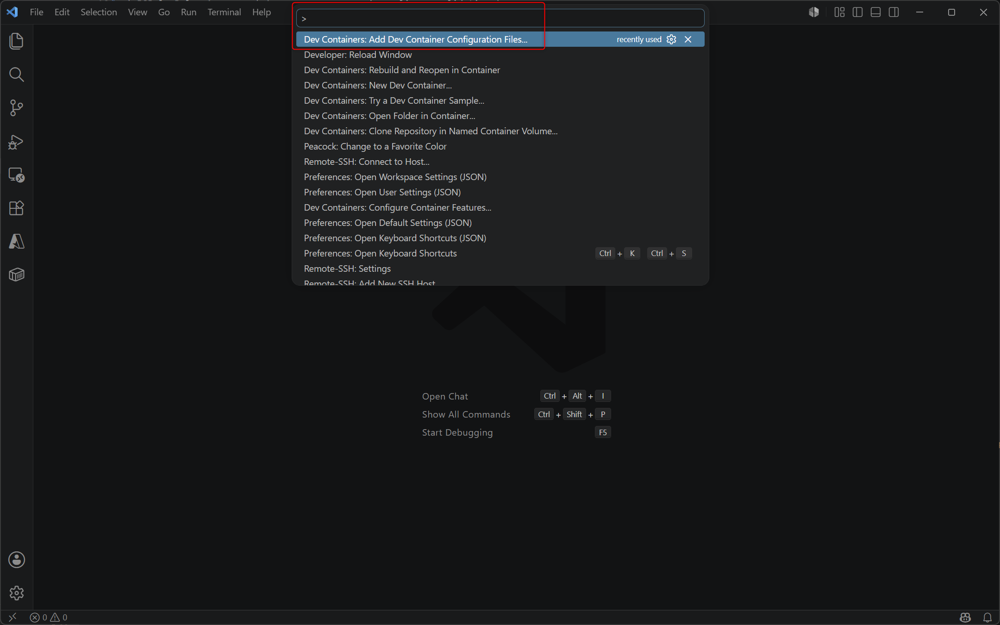
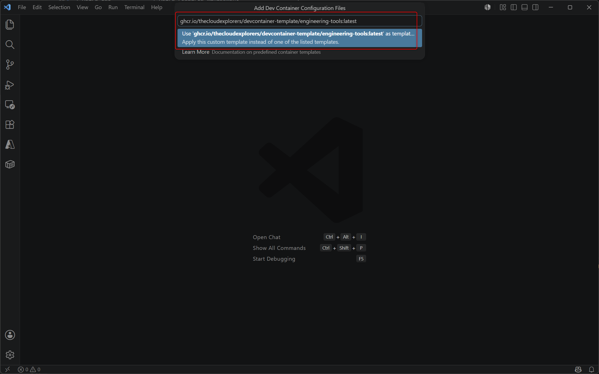

# Engineering Tools — Dev Container Template

A PowerShell-based dev container for Azure and Infrastructure-as-Code engineering. Provides a fully configured environment for cloud development, governance, and AI-assisted workflows.

## Usage

## Image URL

```
ghcr.io/thecloudexplorers/devcontainer-template/engineering-tools:latest
```

### Via VS Code

1. Open the command palette (`Ctrl+Shift+P` / `Cmd+Shift+P` / `F1`)
2. Run **Dev Containers: Add Dev Container Configuration Files**
   
3. In the search box, type the URL of the dev container image: `ghcr.io/thecloudexplorers/devcontainer-template/engineering-tools:latest`
   
4. Select the image and follow the prompts to create the dev container configuration files.
5. Reopen the folder in the dev container when prompted.

### Via `devcontainer.json`

```json
{
  "image": "ghcr.io/thecloudexplorers/devcontainer-template/engineering-tools:latest"
}
```

## Platform

Optimised for Azure-hosted development environments (GitHub Codespaces, Azure Container Instances, Azure Dev Box).

## Repository

## Included tools

| Tool                  | Purpose                                    |
| --------------------- | ------------------------------------------ |
| PowerShell 7          | Primary shell                              |
| Azure CLI             | Azure resource management                  |
| Bicep                 | IaC authoring and deployment               |
| GitHub CLI            | Repository and PR workflows                |
| Claude Code CLI       | AI-assisted development                    |
| draw.io               | Architecture diagramming                   |
| Az PowerShell modules | Azure automation and scripting             |
| PSRule.Rules.Azure    | Azure governance and compliance validation |

## VS Code extensions

| Extension             | Purpose                  |
| --------------------- | ------------------------ |
| Bicep                 | Bicep language support   |
| Azure Resource Groups | Azure portal integration |
| Prettier              | Code formatting          |
| Live Share            | Collaborative editing    |
| Claude Dev            | AI code assistant        |

[github.com/thecloudexplorers/devcontainer-template](https://github.com/thecloudexplorers/devcontainer-template)
